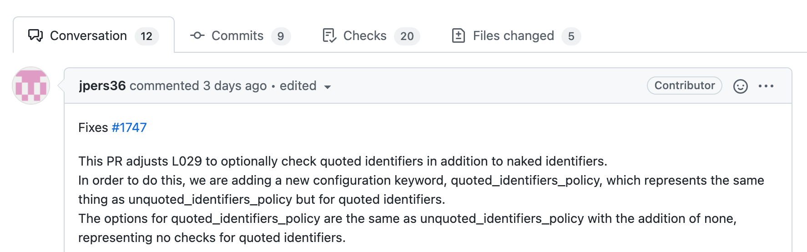
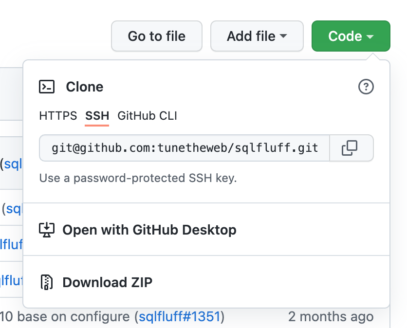
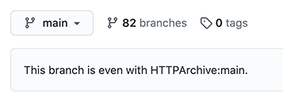
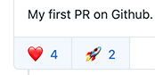

.. _using_git:

How to use Git
==============

Many of the contributors may not be familiar with Git and it can be a
confusing world for those new to it with perplexing terms like *clone*,
*fork*, *branch*, *merge conflicts* and *rebase*. This guide aims to
provide some information to those of you new to Git about the best way
we think of working with it it is and also serve as a quick reference
to some of the Git terms, or commands to use.

Introduction to Git
-------------------

This section will give some basic background to complete newbies to Git.
Feel free to skip to the next section, :ref:`using_git_for_sqlfluff`, where
we talk about how we use it on SQLFluff if you understand the basics already.

What is Git?
^^^^^^^^^^^^

Git is a *distributed version control system*. That mouthful basically means
it's a way of keeping track of changes to our source code and other content -
especially when many, many people are changing various parts of it. The
*distributed* part of it is what makes Git so interesting (and so
complicated!) - there can be many copies of our code, and that can cause
fun and games when trying to keep it in sync!

The original and primary copy of a code base (called a *repository* or
*repo*) is hosted on a server (e.g. GitHub), people will be working on
copies in their local machine, and people may have *forked* a copy of the
repo to another one also hosted on the server - and then that forked copy
may also be copied locally to your machine. Add in different branches in
any of those copies and it can quickly become quite confusing.

Git often involves working with the command line, which might be less
familiar and a bit intimidating for those of you less technically minded.
Graphical front end tools exist to try to replicate this command line
functionality but it's helpful to have some familiarity with using Git
on the command line and with a guide like this, hopefully that becomes
less daunting a prospect!

What is GitHub and how is it different than Git?
^^^^^^^^^^^^^^^^^^^^^^^^^^^^^^^^^^^^^^^^^^^^^^^^

GitHub is not Git, but it is one of the most commonly used instances of
Git and adds various features on top of the core versioning of code that
Git handles. The main thing GitHub gives you is a Git server to store your
code, and a nice web front end to manage it all through. Using the web
front end you can view (and even change!) code, raise issues, open and
review pull requests, use GitHub Actions to automate things (e.g. test
code) and even host wiki pages like this one.

In this Wiki I've tried to differentiate between Git concepts and
commands and those specific to GitHub. Other instances of Git that
you might be familiar with, or use in work or other projects, include
GitLab and BitBucket. They have many of the same features as GitHub.

GitHub also have a graphical front end tool called
`GitHub Desktop <https://desktop.github.com/>`_ for working on on Git
locally and syncing it back to GitHub. Check out the :ref:`github_desktop`
section for tips on how to use it.

SQLFluff makes extensive use of GitHub to help us manage the project
and allow all the many disparate contributors to collaborate easily.

.. _installing_git:

Installing Git
^^^^^^^^^^^^^^

While it is possible to work just using GitHub's website - especially if
just comment on issues and adding your advice - managing the code really
is best done locally on your own computer and then *pushing* changes back
up to GitHub. Git is very popular and widely available (see
`installation instructions`_ for Windows, Mac & Linux). You may already
have it installed, so to check if that's the case, open a command line
and type::

    git --version

If you see a version number returned then you've passed the first step!

If not, then for Windows I recommend installing and using
`Git Bash <https://git-scm.com/download/win>`_ which is a Linux-like command
line. For MacOS the built in Terminal available under Launchpad is fine and
running the above version check will prompt you to install XCode and Git.
For Linux I presume you'll be familiar with how to install this.

.. _`installation instructions`: https://git-scm.com/book/en/v2/Getting-Started-Installing-Git

Git Repos
^^^^^^^^^

A Git *Repository* or *Repo* is a collection of all the code that makes up a
project. Well that's not strictly true as a project may also depend on other
programs and libraries, but typically they are not stored in the project
repo - only the code specific to this project is stored in the repo along
with config files that are used to install any necessary libraries to run
the code and instead installed (e.g. using a command like
:code:`npm install` for node modules).

The main SQLFluff repo is available on GitHub
at: https://github.com/sqlfluff/sqlfluff. However, we also have a few other
repos for the VS Code extension and the like, available
at https://github.com/sqlfluff.

Git Branches
^^^^^^^^^^^^

A repo will usually contain a number of branches. These are copies of the code
where you can work independently on a particular item. The name branch is used
because, like a tree, these can diverge from each other - though, unlike a
tree, they are usually merged back when the work is complete.

There will be one main (or master) branch which everything should be merged
back into when ready. Traditionally these have been called the :code:`master`
branch, but many projects are trying to use more inclusive language and have
switched to using the name :code:`main` or similar instead. SQLFluff moved
to using :code:`main` in 2021.

Creating a branch is very quick and is integral to how Git works. Git stores
branches in an incredibly efficient way and doesn’t literally have a copy of
the same code, but only differences basically. So do not feel like it's a big
deal to create a branch (it's not!) and frequently creating small branches,
and merging them back in to the main branch when ready is the best way to
use Git. Creating large branches or reusing branches for lots of different
changes is not the best way of using Git and will lead to issues.

GitHub Pull Requests
^^^^^^^^^^^^^^^^^^^^

Once your changes are ready to merge back to :code:`main` you open a
*pull request* (often shortened to PR), which creates a special type of GitHub
issue which can be used to merge your changes into the :code:`main` branch.

A pull request is really a GitHub concept and at the end of the day is
basically a fancy way of actioning a merge in Git. Bitbucket also use the
term Pull Request, while GitLab uses Merge Request. It should also not be
confused with :code:`git pull`, which is a Git command to pull down
changes from the server (e.g. GitHub) into your local copy.

An example pull request on GitHub is shown below:

In this pull request there are the following tabs:

* Conversation - this allows you to give some info using GitHub markdown
  (including screenshots if you want). Reviewers can comment, and ask
  questions for you to answer, before merging the pull request into
  the :code:`main` code.

* Commits - this shows a list of links to all the individual changes you
  made to the code. It's not that useful a tab to be honest!

* Checks - this shows all the automated checks run on your code so we
  know it's good! These are setup in the main repo using GitHub Actions
  (or similar) and the results are also shown at the bottom of the
  Conversation tab for open pull requests.

* Files Changed - this is one of the most useful tabs and shows each
  line of code changed. Reviewers should look those this tab, and
  can click on individual lines to make
  `comments or code improvement suggestions`_ which are added to the
  Conversation tab and the person who opened the pull request (called the
  pull request author) can then answer or address the concern (including
  accepting any suggested code changes directly into this change with a
  click).

.. _`comments or code improvement suggestions`: https://docs.github.com/en/github/collaborating-with-issues-and-pull-requests/commenting-on-a-pull-request

You can tag people to review your pull request, assign it to someone
to deal with (not used much as kind of repeat of the author and
reviewers), add labels...etc.

At the bottom of the Conversation tab you will see the following:

.. image:: github_example_merge_panel.png
  :alt: Bottom of a pull request with "Squash and Merge" and "Close" buttons.

This shows on this PR that all checks have passed and this is ready to merge.
Clicking the big green "Squash and Merge" button will copy (the "Merge" part)
all this code into :code:`main` branch with one single commit (the "Squash"
part). Usually you don't need to have all the 100s of commits you have have
done while developing this code change so "Squash" is what you want but you
can change it if you want.

You can also close this pull request if you change your mind with the Close
button at the bottom, or add a comment with the Comment button if you make
a big change to it since opening that you want people following the pull
request to be aware of.

Please note you do **NOT** need to Close and Reopen the pull request (or
even open a new pull request) when you need to make changes based on review
feedback - simply pushing changes to the branch will cause any open pull
request from that branch to automatically be updated and checks to
automatically be rerun. It is expected (and a good thing!) to change
your code based on feedback and this is very much part of the workflow
of pull requests.

GitHub Forks
^^^^^^^^^^^^

As well as branches, GitHub has the concept of *forks*, which basically
means taking a complete copy of the repo (and all its branches at that
time) into your own GitHub account. You can then create a branch in that
fork, and then open a pull request to to merge code from your branch on
your fork, all the way back to the the original repo (called the *upstream*
repo). It may sound like an Inception level of abstraction and confusion
but it actually works quite well once you get your head around it.

.. note::
   There is some confusion as to the name *fork* as traditionally that
   term was used when you wanted to take a project in a different direction
   than the original developers [#f1]_ - so you *forked* the code and never
   merged back again. In GitHub a *fork* is used to make changes outside of
   the original repo but usually with the intention of merging them back
   into the original repo once complete.

   .. [#f1] https://drewdevault.com/2019/05/24/What-is-a-fork.html

Why would you fork when you can just work in the original repo? Well most
projects don't want people messing with the original repo so restrict
permissions to only allow core contributors to create branches in the
original repo. Others **must** therefore fork to make changes and then
open pull requests to the original repo for review before they are
committed.

And it's important to use the correct terminology when working with
forks. Tempting as it is, the original repo should always be referred
to as "original" or "upstream", and never "main" or "master" - which
refer to branches within a repo. Similarly a "local" copy, or "clone"
refers to the copy on your PC as we shall see and that can be of the
original repo or a fork.

Another extra bit of hassle with a fork, is that you must keep it
reasonably up to date with the original, upstream repo. To do that
you periodically merge or rebase the fork back to the original repo
which pulls down changes into your fork. We'll explain how to do
that later.

Cloning a Git Repo
^^^^^^^^^^^^^^^^^^

To work on a project in GitHub you would normally *clone* a repo,
which simply means taking a copy of it on your local PC. It is
possible to make small edits on the GitHub.com website but it's
quite limited and often doesn't allow you to run code locally to
test it for example. You can clone a repo by clicking on green
Code button on the repo's home page (make sure you do this on
your fork and not on the main repo):

This offers a number of options:

* "Clone with SSH" is the recommended way but is
  `a little more complicated to set up`_, but allows you to interact
  with GitHub without entering your GitHub password each time, and
  is basically mandatory if using `2FA for your GitHub account`_.

* "Clone with HTTPS" works but requires you to enter your
  password each time so gets a little tiresome.

Once you copy the SSH or HTTPS URL on the command line simply go
to the command line on your PC, into a directory you want to create
the copy in and type the following (assuming SSH)::

    git clone git@github.com:sqlfluff/sqlfluff.git

You can clone a local copy of the original repo, if you plan to (and
have access to work on branches of that, or you can clone a fork of
the original repo. The above example command clones the original
repo location, and not the fork location - you should change the
git address to the forked version when working from a fork.

After running this command you'll see the repo being downloaded
locally. You can then branch, edit any of the files, or add new
files, or even delete files to your hearts content. Any changes
you make will only be on your machine and then you *push* changes back
up to GitHub. We'll cover that later.

Just like with a fork, you need to keep any local up to date with
both the original, upstream repo, and the GitHub version. This is
done by using the :code:`git pull`, :code:`git merge` and
:code:`git rebase` commands. We'll explain how to do all that below.

.. _`a little more complicated to set up`: https://docs.github.com/en/github/authenticating-to-github/connecting-to-github-with-ssh
.. _`2FA for your GitHub account`: https://docs.github.com/en/github/authenticating-to-github/connecting-to-github-with-ssh

.. _git_merge_conflicts:

Git Merge Conflicts
^^^^^^^^^^^^^^^^^^^

When keeping all the different copies in sync you will inevitably
run into the dreaded "merge conflict" - a rite of passage every
developer must go through. This happens were you've changed some
code, but so has someone else, and their changes has been merged
into :code:`main`, so when you attempt to merge (either by syncing
:code:`main` back **to** your branch to update your branch with
any new changes since branching, or by attempting to open a pull
request **from** your branch) Git will give up and say "I don't know
what to do here - you deal with it!".

In actually fact, dealing with merge conflicts is actually very
simple. When you open the conflicted file you'll see something
like this::

    If you have questions, please
    <<<<<<< HEAD
    open an issue
    =======
    ask your question in Slack
    >>>>>>> branch-a

In this case someone changed the line to "open an issue" and merged
that to :code:`main` (aka HEAD) and you've also changed it to
"ask your question in Slack". Git is warning you that it has been
changed since branching but you also changed it. You simply need
to decide what line you want and then delete all the other lines
(including the ones starting :code:`<<<<`, :code:`====` and
:code:`>>>>`). Then :code:`git add` the "resolved" file to your branch.

You can even do it `directly on GitHub`_.

Merge conflicts get a bad name and people think they are scary to deal
with but Git actually makes it fairly easy. It will also usually only
complain if the exact same line has changed — two people working on
different parts of the same file usually won't see any merge conflicts.

Of course if you're both working on lots of the same code, across lots
of files they can be a real pain to deal with - this is one of the main
reasons to resync your branch back to the original :code:`main` branch
frequently, and also to work on small PRs rather than big unwieldy ones!

.. _`directly on GitHub`: https://docs.github.com/en/github/collaborating-with-issues-and-pull-requests/resolving-a-merge-conflict-on-github

.. _`using_git_for_sqlfluff`:

Recommended way to use Git for SQLFluff
---------------------------------------

When working on SQLFluff you must fork SQLFluff to your own copy and
work on that. SQLFluff contributors do not have access to create branches
in the original repo.

To create your own Fork do the following:

1. Click the Fork button in GitHub and wait for it to complete.

2. Clone your fork locally - for me (tunetheweb) that means running this
   command on your machine :code:`git clone git@github.tunetheweb/sqlfluff.git`

3. Add a link to upstream -
   :code:`git remote add upstream git@github.com:sqlfluff/sqlfluff.git`
   (change this to the HTTPS URL if not using SSH)

It is also **strongly** recommended **not** to work on the :code:`main` branch
of your forked repo. When creating a new branch you will usually branch from
:code:`main`, so once your :code:`main` has extra changes in it, it is no
longer possible (or at least easy!) to create a clean branch for other work.

If you are only working on one thing at once, then using :code:`main` in your
fork may seem the quickest and easiest thing to do, but you'd be surprised how
often you may want to pause that work for a bit and work on something else
instead - and that's one of the advantages of using Git. For example if
you are waiting on a pull request to be reviewed, you may want to work on
another feature in the meantime on a fresh branch, which is completely
independent of your other work. Or perhaps someone discovers an urgent,
and easily fixed, bug in the code that you can quickly fix, before coming
back to the current work. See the :ref:`switching_between_branches`
section below for more info on how to switch branches.

Working on a separate branch to :code:`main` allows :code:`main` to be kept
in sync with upstream :code:`main`, which allows new branches to be created
more easily. It also allows you to merge upstream :code:`main` into your
branch periodically more easily. It also keeps your history of changes
without a long history on each future pull request. Finally, it also also
you to completely reset your :code:`main` back to the same as upstream if
you get it completely messed up, without losing any history in other branches.

.. _resyncing_to_upstream:

Resyncing your main branch to upstream
^^^^^^^^^^^^^^^^^^^^^^^^^^^^^^^^^^^^^^

As discussed above it is recommended to use the :code:`main` branch in your
fork **only** to sync up with the :code:`main` branch in the original SQLFluff
repo. To do that you can do one of several things:

1. You can merge upstream :code:`main` into your :code:`main` branch - however
   if you have any changes, the this will add a commit message for each
   upstream change into your :code:`main`. This means the next time you
   branch and open a pull request you'll see a long history of old commits,
   which is a bit noisy and annoying when they were nothing to do with your
   old pull request. Of course you shouldn't have any changes on :code:`main`
   (because you're not using this as advised above aren't you?) so this
   shouldn't be an issue, but you never know...

2. You can `rebase` your :code:`main` branch to be based on upstream
   :code:`main`. This is a special Git command that basically makes it look
   like you just forked your :code:`main` off of upstream :code:`main` and then
   applies any changes you have made in your repo on top of that, so should
   lead to less risk of old commit messages, but it will still add commits
   for any changes you added. And again, you shouldn't have any changes on
   main so this shouldn't be an issue, but you never know...

3. You can blast away your :code:`main` and basically reset it back to
   upstream :code:`main`. This sounds extreme but is actually my preferred
   option to ensure :code:`main` is super clean and reset back to the same
   as upstream :code:`main`. Note this will (intentionally!) blast away any
   changes from your :code:`main` and you will lose them completely but,
   again, there shouldn't be any changes here if following above advice.

So I prefer option 3 - it's the cleanest and ensures :code:`main` is exactly
the same as upstream, and that there will be no long history of commit
messages in your next branch and pull request.

Commands to force reset your main branch to upstream
""""""""""""""""""""""""""""""""""""""""""""""""""""

You can use the below commands to reset your local fork to upstream and then
push those changes to GitHub.

.. note::
   You should ONLY do this if you are happy to lose all changes to your
   :code:`main` branch and completely reset it as if you'd just forked it.
   If you have changes in flight on the :code:`main` branch then you will
   need to either wait until they have been merged, or move them to a new
   branch before you can do a clean reset of `main`.

Check if upstream already exists::

    git remote -v

Add an upstream remote, if not already added previously::

    git remote add upstream git@github.com:sqlfluff/sqlfluff.git

Then force reset your main branch::

    git fetch upstream
    git checkout main
    git reset --hard upstream/main
    git push origin main --force

After this your should visit your forked repo on GitHub and check you get a
message that *"This branch is even with sqlfluff:main."*:

Creating and working on a branch
^^^^^^^^^^^^^^^^^^^^^^^^^^^^^^^^

So, when you're ready to make your first changes, do the following:

1. Resync your local copy to upstream as per above (unless you've just
   forked it, in which case you can skip this step)

2. Make sure you are in the main branch - :code:`git checkout main`

3. Branch `main` to a new branch with a meaningful branch name. For example
   to work on an issue to add new Posgres Create Table you'd run this
   command - :code:`git checkout -b postgres-create-table` (note the
   :code:`-b` which means "create a new branch please").

4. Make your changes using your favourite code editor (I recommend `VSCode`_
   myself).

5. If making code changes to the website then test them - follow instructions
   in `CONTRIBUTING.md`_ to set up the environment and then use
   :code:`tox -e generate-fixture-yml,cov-init,py39,cov-report,linting` to
   run most of the tests.

6. Add any new files you added in this change that you want tracked in
   git - e.g. :code:`git add text/fixtures/dialects/*.sql`. You also need to
   do this to re-add merge conflict files that you have resolved. You typically
   do not need to add other files that are already in the repo that you have
   changed, as Git will track those already.

7. Commit your changes - :code:`git commit -a`. This means “save all changes
   to Git (for tracked files)”. If you only want to commit some files, then
   :code:`git add` just the files you want and then use :code:`git commit`
   without the :code:`-a` option. When you commit you need to add a message.
   Git will automatically open your default Git editor - usually :code:`vi`
   which can take some getting used to but basically type your message and
   then type :code:`Esc : w q !` to enter command mode (:code:`Esc`), start
   a command (|colon|) save your file (:code:`w` for write) and quit
   (:code:`q`) and force override any errors on save (:code:`!`). See the
   next section for an alternative method if you're not comfortable with
   :code:`vi`. And btw if you want to cancel the commit at this stage, remove
   any message you added and type `Esc q !` to quit without saving any changes
   and Git will see you didn't add a message and cancel the commit.

8. Push your committed changes to GitHub - :code:`git push`. If this is your
   first push of this branch to GitHub, then git will tell you you have to
   use a slightly different command:
   :code:`git push --set-upstream origin postgres-create-table`

9. If there are any changes already in GitHub (e.g. of other people are also
   working on this branch), then you will get and error and need to do a
   :code:`git pull` to pull them down locally before you are able to push
   any more changes back up to GitHub.

10. Repeat steps 4-9 as often as you want until you are happy to open a pull
    request to merge this back into SQLFluff code base.

.. _`VSCode`: https://code.visualstudio.com/
.. _`CONTRIBUTING.md`: https://github.com/sqlfluff/sqlfluff/blob/main/CONTRIBUTING.md

.. |colon| raw:: html

    <code class="code docutils literal notranslate">:</code>

Committing changes - to vi or not to vi
"""""""""""""""""""""""""""""""""""""""

My preferred method of committing changes is to use this::

    git commit -a

This takes all the changes for existing tracked files and adds them to the
commit. New files still need to be added with :code:`git add` but all files
currently tracked by Git are automatically included without having to use
:code:`git add`. This then opens the default Git editor (usually :code:`vi`)
and lists the files for this commit, any files not included and allows you
to add the message and complete the commit. If you close :code:`vi` without
adding a message then it cancels the commit.

However :code:`vi` can be quite a barrier to people as it's quite a confusing
editor with a "command" and an "edit" mode, and needing to remember command
sequences (like :code:`ESC + w + q + !`). For those not familiar with linux
and :code:`vi` this might be quite a stumbling block.

You can provide the message on the command line so you don't have to got
near :code:`vi` using a sequence of commands like this::

    git status
    git add file1 file2
    git commit -m "Committing file1 and file2"

This does require you to add the files or folders first so a bit more painful
than :code:`git commit -a`. Alternatively you use the :code:`-a` and :code:`-m`
switches together::

    git status
    git commit -a -m "Committing all open files"

The downside is that, unlike the :code:`vi` method, it won't show you the list
of files it's going to commit, so is a bit more dangerous, hence why I prefer
the :code:`vi` method instead. However, if you do a :code:`git status` before
you commit, you should see the files that will be committed. Plus you can
always revert changes if you need to.

So, in summary :code:`vi` method is preferred but can be more complicated to
those not familiar with it so can give commit message on command line but
take care with it.

Keeping your branch up to date
""""""""""""""""""""""""""""""

It is also recommended to merge any changes that have happened to SQLFluff
code (in its :code:`main` branch) into your branch periodically in case it
affects your code, and particularly important to do this just before
opening a PR.

To merge changes into a forked repo from upstream :code:`main` do the
following:

1. Commit any changes in the branch you are working on.
2. Update you local copy of :code:`upstream` - :code:`git fetch upstream`
3. Merge the changes from upstream main into your
   branch - :code:`git merge upstream/main`
4. Commit the merge - :code:`git commit -a`
5. Push all your changes up to GitHub - :code:`git push`

Or to merge from a branch on the main repo do the following:

1. Commit any changes in the branch you are working on.
2. Update you local copy of :code:`main` - :code:`git fetch origin main`
3. Merge the changes from upstream main into your
   branch - :code:`git merge main`
4. Commit the merge - :code:`git commit -a`
5. Push all your changes up to GitHub - :code:`git push`

.. _switching_between_branches:

Switching between branches
""""""""""""""""""""""""""

Git allows working on several branches at once. This allows you to work on
something else while you are stuck on one bit of work (waiting for answers,
or pull request feedback, or you just fancy a break!). Use
:code:`git checkout` to switch between branches and use :code:`git status`
to ensure all your changes are committed when switching between branches.

For example, let's say you are working on :code:`feature1` branch::

    git checkout main
    git pull
    git checkout -b feature1
    # Make some changes
    git commit -m "Commit my changes for feature1"
    # Make some more changes
    git commit -m "Commit some more changes for feature1"
    # Push changes to Github.com if you want to (always good to do this in case your computer dies!)
    git push
    # Note the first time you push a new branch you will need a slightly different push comment:
    # `git push --set-upstream origin feature1`
    # Helpfully, git will tell you this if you try using just `git push`.

And then you want to take a break from :code:`feature1`, in which case you
should open a new branch - in most cases you want to branch from :code:`main`
again, and not from :code:`feature1` branch so make sure you flip back to
:code:`main` again if this is the case. If working on a fork, you should also
check your :code:`main` is up to date first - see the :ref:`resyncing_to_upstream`
section above::

    # Check your branch is clean and everything has been committed
    git status
    # Create a new branch from main (note I've not included the resyncing of main to upstream here for forks)
    git checkout main
    git pull
    git checkout -b feature2
    # Make some changes and push your new branch to GitHub
    git commit -m "Commit some changes for feature2"
    git push --set-upstream origin feature2
    # Make some more changes and push those too
    git commit -m "Commit more changes for feature2"
    git push

You are now free to switch back to :code:`feature1` if you want using
:code:`git checkout` (note you don't need the :code:`-b` flag as that's
only needed to create a new branch that doesn't exist, whereas just
switching between branches that already exist don't need it)::

    git checkout feature1

And then switch back to :code:`feature2` later::

    git checkout feature2

The primary concern with multiple branches like this is getting yourself
confused! Using :code:`git status` here is your friend to double check
you're on the correct branch and all outstanding changes have been committed.

As with lots of things in Git, there are many ways to handle branches
(including the :code:`git branch` command), but I'd encourage you to
stick with few commands and use :code:`git checkout`, :code:`git commit`,
:code:`git push`, :code:`git pull` and :code:`git status` as much as
possible as you can do most things with those and it's already getting
confusing!

The other alternative is to just create a new folder and clone the whole
repo again and manage it completely separately. This can be easier, safer
and less confusing for those less familiar with Git if working on a limited
number of branches. However it doesn't scale very well and is not the way
you're going to get the most out of Git so as soon as you go beyond a second
branch I'd strongly encourage you get used to checking out between branches.

I do encourage separate folders however if you have different repos (e.g.
your do some of the main work on the HTTPArchive repo, and some work on
your own fork) as switching repo that a folder points to, while also
possible, is adding yet more confusion to an already complex thing! 🙂

Opening a Pull Request
^^^^^^^^^^^^^^^^^^^^^^

Once you are finished making changes, you should take the following steps
to open a pull request back to the original repo to accept your code into
SQLFluff:

1. Merge in any changes that happened to SQLFluff code since you branches (see above).
2. Run all the automated tests :code:`tox -e generate-fixture-yml,cov-init,py39,cov-report,linting`.
3. Make sure all your changes are pushed to GitHub.
4. Open a pull request in GitHub.
5. If the pull request closes an issue then you can add "Closes #123" or
   "Fixes #123" in the first comment and GitHub will automatically close
   issue #123 when the pull request is merged. If it doesn't fully close
   the issue, then you should instead say something like "Makes progress on
   #123" which will create a link on original issue but not close it.

As mentioned above, you can make more changes to your branch and push them
up to GitHub and the Pull Request will automatically be updated. There is
no need to close the PR and reopen a new one.

Actioning feedback from pull requests
^^^^^^^^^^^^^^^^^^^^^^^^^^^^^^^^^^^^^

When your pull request is reviewed, the first bit of feedback you're likely
to see if from the automated tests that run every time a pull request is
opened. They take a few minutes to run and then you will then give you a
satisfying green tick, or a scary red cross.

Merge conflict checks
"""""""""""""""""""""

The first check that GitHub itself will do is check for any
:ref:`git_merge_conflicts` and these must be resolved before the pull request
can be merged. If you merge :code:`main` to your code before submitting a pull
request, then it's unlikely you'll get any of these (unless someone's got in
real quick while you were opening it!) which is why it's recommended to do
that, but other pull requests can be action while yours is being reviewed so
can still happen. Smaller pull request, touching few files reduces the chance
of this so again, where at all possible, break up changes into smaller batches.

Linter checks
"""""""""""""

Another check that we perform is linting the code in the pull request. This
runs automated checks for errors or code styling and formatting issues that
don't match the code conventions we use.

Python code is linted with `flake8` and you can run this command on any files
to see similar linting issues. You can use `black` to auto-fix most flake8
issues, though some need to be manually addresses.

Code review feedback
""""""""""""""""""""

After the automated tests have passed the code will be reviewed manually by
a maintainer, or another contributor. They can ask questions, or make
suggestions to change the code.

Look upon a code review as an opportunity to learn and improve your code.
Feedback can be tough to hear after you've worked hard on code, but stay
aware that it is meant with the best possible intention to provide feedback
to you for this and future commits, and to keep our codebase to a high
standard. It is not a personal sleight upon you or your code, and if you
are getting annoyed with feedback I suggest you take a break and step away
and read it again later, in a fresh light. Of course if if you feel that a
reviewer is acting inappropriately then please raise it - we have a
`Code of Conduct`_ and want all contributors to feel welcome. Feel free to
also reach out to a maintainer if you would like to discuss something
privately.

When a reviewer makes a code suggestion you can accept it right in GitHub
and it will automatically update your branch. As this happens in GitHub
directly, just make sure you do a :code:`git pull` next time you are working
locally on your code to pull down these changes. It's quite slow to accept a
lot of changes this way, so if there are a lot of changes then sometimes
better to change locally in your favourite editor, and then push one commit
with the fixes, and then mark each of the suggestions as resolved. Any
suggestions on lines which have changes since they were raised, will be
marked as **outdated** which makes them easy to spot.

Reviewers may also make small, seemingly pedantic changes - usually they
will include the word "nit", to indicate this is a "nitpick" in these.
Like the linting, they can seem needless, but they help maintain our
code quality.

It should also be noted that not all suggestions may be valid! Reviewers
can make a mistake just as easily as the pull request author (more easily
in some ways as they often will be reviewing based on reading the code
rather than testing it). Feel free to push back on suggestions when you
disagree with them. However, it is best to get consensus between reviewer
and pull request author where at all possible so explain why you don't
think you should make the change being suggested rather than just ignoring
the suggestion or resolving it without a comment.

After addressing feedback, please re-request a review by clicking the little
two arrow icon next to the reviewer name, or make a comment (e.g. "All
feedback addresses. I think this is good to merge now."). Sometimes it's
difficult to know if someone is still working on feedback and a pull
request may be left unintentionally, getting out of date, because
reviewers are not aware that it's good for a re-review or merge.

Only SQLFluff maintainers can merge pull requests, but **every contributor**
can review pull requests, and merging becomes a lot easier (and so more
likely!) if someone else has already had a look through the changes. Please,
please, please help us `reviewing_pull_requests`_ to help spread the load!

Draft pull requests
"""""""""""""""""""

It is also possible to open a draft pull request, if you want early feedback
on your code or approach. Please remember to convert to a full pull request
when happy.

Additionally if making a large number of changes (for example if you need to
update every dialect), then best to do this in only one or two files initially,
open a pull request (whether draft or full) and get feedback on your approach
before you spend time updating all the files! It's much easier to review
code changes if they are not drowned out by lots of identical changes that
needs that code in the same pull request, and much less likely to result in
merge conflicts. Then the rest of the files can be added to the pull request,
or a separate one opened for those (maybe a new pull request per language if
you want different translators to approve any changes).

.. _reviewing_pull_requests:

Reviewing pull requests
^^^^^^^^^^^^^^^^^^^^^^^

As mentioned above we **strongly** encourage contributors to help review pull
requests. This is a voluntary, collaborative effort for us all and depending
on one or two people creates a bottleneck and a single point of failure for
the project.

Even if a review pulls up nothing, it is important to approve the pull
request - this indicates that it has been reviewed and is just as useful
(if not more so) as commenting on code or making suggestions.

Do also be conscious of how feedback will be read. We have many first
time contributors who may not be as familiar with language (either programming
language or English language!) so do try to avoid technical terms,
colloquialism...etc. Though we are aware of some very commonly used acronyms
and terms (which we've included in our :ref:`glossary_of_git_terms`) like
LGTM ("Looks Good To Me").

Do be mindful as well that pull request authors have voluntarily spent time
on this and we wish to encourage that and foster an inclusive environment.
Offensive language is forbidden by our `Code of Conduct`_.

Do remember that a code review is also about reviewing the authors changes,
and not about showing off your own knowledge! Try not to get side-tracked
but instead raise a new issue if you want to consider something else that
comes up during a code review but is not directly related.

On that note, do also remember that code can be improved incrementally.
Small changes are much better in Git. So, while it's OK to point out a
fuller solution do remember that `Perfect is the enemy of good`_ and accepting
a change that is an improvement and then improving further in future
iterations can often be better than holding out for the perfect solution
that may never come. Of course that doesn't mean we should accept code that
regresses the quality, or seems like the wrong way of doing it completely!

And finally, we strongly encourage positive GitHub reactions - particular
for new contributors. They give quick, encouraging, feedback and add a
playful, fun tone:

We discourage the negative ones though (thumbs down 👎, or confused 😕).
Better to add a comment (politely!) explaining your concerns and then if
others agree with you, they can "thumbs up" your comment. This keeps things
on a positive tone and also means your cause for concerns are fully understood.

.. _`Code of Conduct`: https://github.com/sqlfluff/sqlfluff/blob/main/CODE_OF_CONDUCT.md
.. _`Perfect is the enemy of good`: https://en.wikipedia.org/wiki/Perfect_is_the_enemy_of_good

.. _github_desktop:

GitHub Desktop
--------------

GitHub Desktop is a Windows and MacOS app that provides a visual interface to
GitHub. It reduces the need to use and understand Git via the command line.

This section will provide some tips on performing some common tasks via the
GitHub Desktop

Installing GitHub Desktop
^^^^^^^^^^^^^^^^^^^^^^^^^

First make sure you have Git installed. See our section on
:ref:`installing_git` for more details.

You can then download the install file from https://desktop.github.com/, with
further instructions from their `Installing and configuring GitHub Desktop`_
document. Your main tasks will be to `Authenticate with GitHub`_ and
`Configuring Git for GitHub Desktop`_ so that the systems know who you are.

.. _`Installing and configuring GitHub Desktop`: https://docs.github.com/en/free-pro-team@latest/desktop/installing-and-configuring-github-desktop
.. _`Authenticate with GitHub`: https://docs.github.com/en/free-pro-team@latest/desktop/installing-and-configuring-github-desktop/authenticating-to-github
.. _`Configuring Git for GitHub Desktop`: https://docs.github.com/en/free-pro-team@latest/desktop/installing-and-configuring-github-desktop/configuring-git-for-github-desktop

Cloning the SQLFluff repo
^^^^^^^^^^^^^^^^^^^^^^^^^

If you have not done already, you will want to clone a copy of the
https://github.com/sqlfluff/sqlfluff repo into your computer. The simplest way
is to follow `Cloning a repository from GitHub to GitHub Desktop`_ where you
go to the repository on the website and select "Open with GitHub Desktop".
This will open a window where you can click "Clone" and the job will be done.

.. _`Cloning a repository from GitHub to GitHub Desktop`: https://docs.github.com/en/free-pro-team@latest/desktop/contributing-and-collaborating-using-github-desktop/cloning-a-repository-from-github-to-github-desktop

Navigating GitHub Desktop
^^^^^^^^^^^^^^^^^^^^^^^^^

Once you have cloned repositories you will be able to select them via the
"Current repository" toolbar button, just under the menu on the left. By
default the sidebar will show you what edits have been made to the
repository, and the main section shows actions you may want to perform.

Updating your repository (Pull origin)
^^^^^^^^^^^^^^^^^^^^^^^^^^^^^^^^^^^^^^

Over time the original repository will get updated and your copy will become
out of date. GitHub Desktop will highlight if your repository is out of date,
with an option to pull any changes from the origin so that you have the latest
versions.

.. _github_desktop_creating_a_branch:

Making your own edits (creating a branch)
^^^^^^^^^^^^^^^^^^^^^^^^^^^^^^^^^^^^^^^^^

You want to create your own branch before you start as you very likely
do not have permission to edit the SQLFluff :code:`main` branch. A branch
is a way for you to group your own edits so you can later
submit (push) them for review. Then, when they are approved, they will get
merged back into the main branch.

Before creating a branch, make sure you're currently on the :code:`main`
branch and it is up to date (see above).

If you click on the "Current branch" tab in the toolbar you will see all
the public branches in play. To create your own branch, enter a new name
in the textbox at the top and click the "Create new branch" button.

Publishing your branch
^^^^^^^^^^^^^^^^^^^^^^

At the moment your branch is only known to you. If you want others to see
it, then you need to publish it. GitHub Desktop will prompt you to do that.

Once published you and others can select your branch on the GitHub website.

Editing your branch
^^^^^^^^^^^^^^^^^^^

You can edit the repository using your favourite editor. As you
edit, GitHub Desktop will show you what changes you have made.

Note that you can change branches at any time, but I suggest you
commit and push any edits (see next) before you switch as things
can get confusing. If you are working with multiple branches,
always keep an eye out to make sure you're on the right one when
working.

Committing and pushing your edits to the web
^^^^^^^^^^^^^^^^^^^^^^^^^^^^^^^^^^^^^^^^^^^^

Every once in a while you want to store and document your changes.
This can help you or others in the future. You also have to commit
before you can share (push) your changes with anyone. You can
quickly commit your current edits via the form to the bottom left.

Once you have commits you will be prompted to push those commits to
GitHub. I typically do this straight after committing.

.. _getting_your_changes_accepted:

Getting your changes accepted
^^^^^^^^^^^^^^^^^^^^^^^^^^^^^

At this point you have a branch with edits committed and everything
pushed to GitHub. Once you are happy with your work, you want it to
be reviewed, approved and merged back into the main repository.

For this I switch back to the website, as it is there you will be
communicating with reviewers. To get this stage started you need to
create a pull request. Go to the `SQLFluff responsitory on GitHub`_,
make sure your branch is selected, then click the Pull request link
and follow the instructions. This will notify the reviewers who will
help you to get your changes live.

.. _`SQLFluff responsitory on GitHub`: https://github.com/sqlfluff/sqlfluff

Keeping the forked repository up to date
""""""""""""""""""""""""""""""""""""""""

The main branch of your fork should be kept in sync with the original
repository (rebased). Especially before you create any branches to make
edits. Details on how to do this are in the :ref:`resyncing_to_upstream`
section.

Making your own edits
"""""""""""""""""""""

This is done in the exact same way as before (i.e. in
:ref:`github_desktop_creating_a_branch`). Create a branch from your master
(make sure master is up to date using the above process), publish the branch,
edit the files in the branch, commit your edits, push back to GitHub.

With a forked repository the process to get your edits accepted is about the
same as before (i.e. in :ref:`getting_your_changes_accepted`). Go to the web page
for your copy of the repository and create a pull request.

.. _glossary_of_git_terms:

Glossary of terms
-----------------

This is a list of terms to those less familiar with Git/GitHub:

* **branch** - a copy of the code within a repo, where you may be working on
  code that is not ready to commit back to the main branch. Note Git actually
  only stores differences so it's not really a copy, but that's just an
  efficiency in Git and you can consider it a copy to all intents and purposes.
* **fetch** - a git command which downloads all changes from a remote repo
  (i.e. a server) to a local one.
* **fork** - a complete copy of a repo and all it's branches.
* **LGTM** - Short hand for Looks Good To Me - typically used approving
  a pull request.
* **local** - a complete copy of a repo on your PC
* **main** - the primary branch of SQLFluff repo. Some other repos use
  :code:`master` for this.
* **master** - an alternative name for :code:`main` branch used by some repos.
* **merge** - to copy changes from one branch into another branch.
* **merge request** - what a pull request is also known by particularly in
  GitLab an alternative to GitHub.
* **origin** - the server version if the repo (the opposite of local).
* **pull** - to fetch changes from a remote repo, and then merge them into
  this branch in one step.
* **pull request** - a way to merge changes back to the main branch. A pull
  request is a special issue type that allows the potential merge to be
  reviewed and commented on before it is merged.
* **rebase** - to bring a branch up to date, as if it had been created from
  now, while maintaining the existing changes on top.
* **repo/repository** - a git project which is basically a collection of
  files - which may exist in several branches.
* **upstream** - the original repo that a fork was created from.
